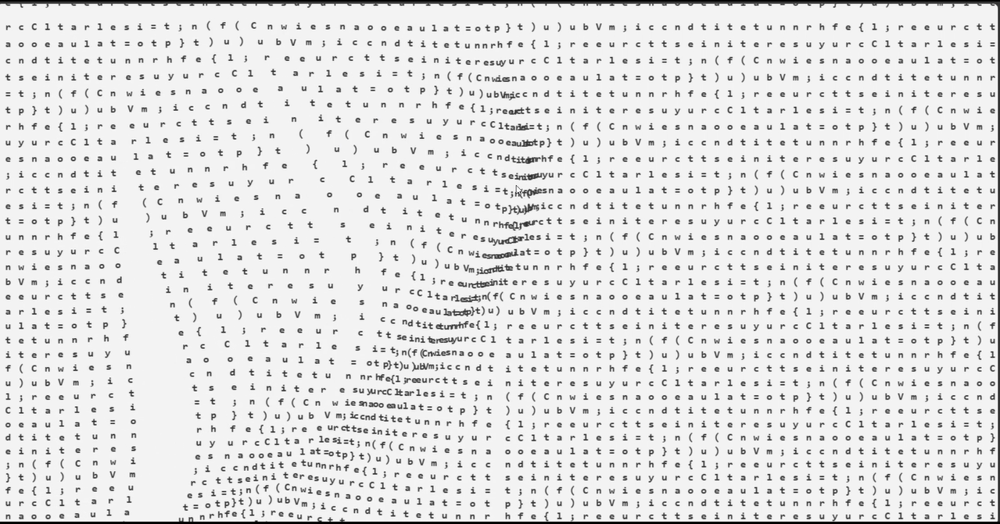

# 🧵 Interactive Code Curtain

A beautiful physics-based interactive code curtain built using **HTML5 Canvas**, **JavaScript**, and the **Web Audio API**. Move your mouse through the hanging code to create realistic cloth motion and dynamic plucking sounds.

---

## 🌐 Live Demo

👉 https://barath-codes-007.github.io/Interactive-Code-Curtain/

---

## 📸 Screenshot



---
## 📸 Demo


## ✨ Features

- 🧵 Realistic cloth simulation using Verlet Physics
- 🖱️ Interactive mouse interaction
- 🔊 Dynamic plucking sound effects
- ⚡ Smooth real-time animation
- 💻 Code characters form an interactive curtain
- 📱 Responsive full-screen canvas
- 🎨 Clean and minimal UI
- 🚀 Lightweight and fast

---

## 🛠 Built With

- HTML5
- CSS3
- JavaScript (ES6)
- HTML5 Canvas API
- Web Audio API

---

## 🚀 Getting Started

Clone the repository

```bash
git clone https://github.com/Barath-codes-007/Interactive-Code-Curtain.git
```

Open the project folder and launch `index.html` in your browser.

---

## 📂 Project Structure

```
Interactive-Code-Curtain/
│── index.html
│── README.md
│── screenshot.png
```

---

## 💡 Inspiration

This project explores real-time cloth simulation, physics-based animation, and procedural audio generation to create an interactive and visually engaging web experience.

---

## 👨‍💻 Author

**Barath**

GitHub: https://github.com/Barath-codes-007

---

⭐ If you enjoyed this project, consider giving it a star!
